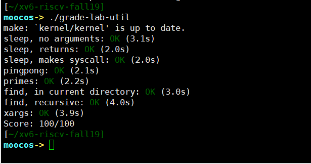

# lab1 实验目的：熟悉xv6系统和它的系统调用

## 一. 实验前准备
按计划，先阅读下面三项

1. 介绍： <https://pdos.csail.mit.edu/6.828/2019/lec/l-overview.txt>
   > 大体意思是：6.S081专注于系统调用接口的设计和实现。
  我们将研究UNIX（Linux，Mac，POSIX和xv6）。
  让我们看看程序如何使用系统调用接口。
2. 例子： <https://pdos.csail.mit.edu/6.828/2019/lec/l-overview/>;
    > 实例 给了多个.c文件，上面的链接中有对应的英文解释，自己看的时候可以对应翻译到.c文件
  另外，推荐<https://mit-public-courses-cn-translatio.gitbook.io/mit6-s081>，大佬应该是看了视频课程，并做了翻译，很强；
3. read chapter 1 of the xv6 book
   > 推荐使用知云文献翻译，中英文对照阅读

4. 接下来就是进行实验：作业链接：<https://pdos.csail.mit.edu/6.828/2019/labs/util.html>


## 二. 知识点

1. UNIX约定：fd 0是“标准输入”，1是“标准输出”
2. FD可以做一个指向“管道”的引用,就像对文件一样引用
  系统调用pipe()创建一对FD
    从第一个FD读取
    从第二个FD写入


3. 单词
    >amusement [ə'mjuzmənt] 娱乐
 
    >assignment [ə'saɪnmənt] 任务，作业

4. vi 跳转到指定行号：

    ```cpp
    // 第一种方式
    $ vi makefile
    $:n //n 为行号

    // 第二种方式
    $ vi +169 makefile // 打开makefile 直接跳转到169行
    ```

5. 在当前文件夹下的所有文件内寻找包含3G的文件并打印出行号
  
    ```cpp
    // 在当前文件夹下寻找包含3G的行号
    $ grep 3G . -rn
    ```
      按照作业一开始，需要切换到util分支，切换之后，执行make，make qemu; 发现启动不了，内存溢出,报错信息如下，解决过程也附在下面：
    ```c
    // make qemu 报错信息
    qemu-system-riscv64 -machine virt -kernel kernel/kernel -m 3G -smp 3 -nographic -drive file=fs.img,if=none,format=raw,id=x0 -device virtio-blk-device,drive=x0,bus=virtio-mmio-bus.0
    qemu-system-riscv64: cannot set up guest memory 'riscv_virt_board.ram': Cannot allocate memory
    make: *** [qemu] Error 1
    // 查看下自己的内存大小，剩余654M，果然不够3G，毕竟是虚拟机
    moocos-> free -h
                total       used       free     shared    buffers     cached
    Mem:          3.4G       2.7G       654M        14M       242M       1.6G
    -/+ buffers/cache:       952M       2.4G
    Swap:           0B         0B         0B
    // 查看下是哪里写着3G的内存，发现是makefile文件
    moocos-> grep 3G -rn
    Makefile:169:QEMUOPTS = -machine virt -kernel $K/kernel -m 3G -smp $(CPUS) -nographic
    ```
    到这里已经排查到是makefile 文件里设定的3G的启动内存大小，vi进去修改3G为128M，然后make clean,make, make qemu,搞定；


附提问解答：

1. 学生提问：为什么父进程在子进程调用exec之前就打印了“parent waiting”？
    > Robert教授：这里只是巧合。父进程的输出有可能与子进程的输出交织在一起，就像我们之前在fork的例子中看到的一样，只是这里正好没有发生而已。并不是说我们一定能看到上面的输出，实际上，如果看到其他的输出也不用奇怪。我怀疑这里背后的原因是，exec系统调用代价比较高，它需要访问文件系统，访问磁盘，分配内存，并读取磁盘中echo文件的内容到分配的内存中，分配内存又可能需要等待内存释放。所以，exec系统调用背后会有很多逻辑，很明显，处理这些逻辑的时间足够长，这样父进程可以在exec开始执行echo指令之前完成输出。这样说得通吧？
2. 学生提问：子进程可以等待父进程吗？
    >Robert教授：Unix并没有一个直接的方法让子进程等待父进程。wait系统调用只能等待当前进程的子进程。所以wait的工作原理是，如果当前进程有任何子进程，并且其中一个已经退出了，那么wait会返回。但是如果当前进程没有任何子进程，比如在这个简单的例子中，如果子进程调用了wait，因为子进程自己没有子进程了，所以wait会立即返回-1，表明出现错误了，当前的进程并没有任何子进程。
  **简单来说，不可能让子进程等待父进程退出。**
3. 学生提问：当我们说子进程从父进程拷贝了所有的内存，这里具体指的是什么呢？是不是说子进程需要重新定义变量之类的？
    >Robert教授：在编译之后，你的C程序就是一些在内存中的指令，这些指令存在于内存中。所以这些指令可以被拷贝，因为它们就是内存中的字节，它们可以被拷贝到别处。通过一些有关虚拟内存的技巧，可以使得子进程的内存与父进程的内存一样，这里实际就是将父进程的内存镜像拷贝给子进程，并在子进程中执行。
  实际上，当我们在看C程序时，你应该认为它们就是一些机器指令，这些机器指令就是内存中的数据，所以可以被拷贝。
4. 学生提问：如果父进程有多个子进程，wait是不是会在第一个子进程完成时就退出？这样的话，还有一些与父进程交错运行的子进程，是不是需要有多个wait来确保所有的子进程都完成？
    >Robert教授：是的，如果一个进程调用fork两次，如果它想要等两个子进程都退出，它需要调用wait两次。每个wait会在一个子进程退出时立即返回。当wait返回时，你实际上没有必要知道哪个子进程退出了，但是wait返回了子进程的进程号，所以在wait返回之后，你就可以知道是哪个子进程退出了。

## 三. 作业

1. 实现sleep
    >Implement the UNIX program sleep for xv6; your sleep should pause for a user-specified number of ticks. (A tick is a notion of time defined by the xv6 kernel, namely the time between two interrupts from the timer chip.) Your solution should be in the file user/sleep.c. 我的代码应该写到 user/sleep.c里面

    > 提示:
    a. Look at some of the other programs in user/ to see how you can obtain the command-line arguments passed to a program. If the user forgets to pass an argument, sleep should print an error message. 我可以看看user下的其它文件，看看是怎么获取命令行参数，记得对空参数的处理

    >The command-line argument is passed as a string; you can convert it to an integer using atoi (see user/ulib.c).
    Use the system call sleep (see user/usys.S and kernel/sysproc.c). sleep功能最终应该调用 系统调用sleep 
    
    >Make sure main calls exit() in order to exit your program. 调用exit()确保自己的程序最后要退出

    >Add the program to UPROGS in Makefile and compile user programs by typing make fs.img. 把自己的程序写到makefile里的`UPROGS=`，并且使用`make fs.img` 进行编译
    
    >Look at Kernighan and Ritchie's book The C programming language (second edition) (K&R) to learn about C. 跟着大佬的书学习C语言

    ```cpp
    // user/sleep.c
    #include "kernel/types.h"
    #include "user/user.h"

    int main(int argc, char *argv[])
    {
        if (argc <= 1)
        {
            printf("usage: sleep seconds!\n");
            exit();
        }

        int nsleep = atoi(argv[1]);
        sleep(nsleep);
        exit();
    }
    ```
    >在util分支下，新建属于自己的util分支，新建user/sleep.c文件，它编译之后，生成sleep文件；
xv6启动之后，shell输入sleep,就是运行上面编译后的文件；所以`sleep 10`这样的命令行参数，使用main函数的入参就可以了；
这里argc(入参的数量)包含sleep本身，所以`argv[0] = "sleep"`, `argv[1] = "10"`;
然后根据提示，调用`atoi`和`sleep(int n)`即可；这个sleep 参数在正常linux下应该是多少s，这里的参数是tick，解释为时钟，sleep 10感觉并没有10s，先不做深究；
测试的时候，可以运行`./grade-lab-util sleep`进行测试，下面例子的也是一样；

1. 实现pingpong

    >Write a program that uses UNIX system calls to ``ping-pong'' a byte between two processes over a pair of pipes, one for each direction. The parent sends by writing a byte to parent_fd[1] and the child receives it by reading from parent_fd[0]. After receiving a byte from parent, the child responds with its own byte by writing to child_fd[1], which the parent then reads. Your solution should be in the file user/pingpong.c.

    >用一对管道(管道是单向的,一个进程只处理管道读或者写端，不能同时处理读或者写，不然没人知道你写的数据是要发给另一个进程还是发给你自己；所以这里需需要pipe()两次使用两个管道)实现ping-pong操作，

    ```cpp
    #include "kernel/types.h"
    #include "user/user.h"

    int main(int argc, char *argv[])
    {
        int parient_fds[2], child_fds[2];
        // create a pipe, with two FDs in fds[0], fds[1].
        pipe(parient_fds);
        pipe(child_fds);
        int pid;
        pid = fork();
        char buff[100];
        if(0 == pid)
        {
            // 子进程 这里不关闭不用的文件描述符parient_fds[0]，本身这个程序使用不多，就没关，等程序退出时自行处理, 写这个程序的时候，也没有意识到需要关闭不用的fd，primes里就需要关闭里
            write(parient_fds[1], "ping\n", 5);
            read(child_fds[0], buff, sizeof(buff)); // 阻塞，等待父进程写入pong
            printf("3: received %s", buff);// 写入pong的时候已经加\n，所以这里打印的时候，不用加\n
            exit();
        }else
        {
            // 父进程
            read(parient_fds[0], buff, sizeof(buff));
            printf("4: received %s", buff);
            write(child_fds[1], "pong\n", 5);
            wait();
        }
        
        exit();
    }
    ```

2. 实现 primes

    >Write a concurrent version of prime sieve using pipes. This idea is due to Doug McIlroy, inventor of Unix pipes. The picture halfway down this page<https://swtch.com/~rsc/thread/> and the surrounding text explain how to do it. Your solution should be in the file user/primes.c.
    使用pipes写一个并发版本的素数(质数)筛选器，放在primes.c文件里

    ```cpp
    #include "kernel/types.h"
    #include "user/user.h"

    // createprocess 要做的事情: 保存当前进程的数，当前的进程，只留存自己第一次接收到的数字
    // 然后判断之后接收到的数字，能不能被第一次接受到的数组整除
    // 如果可以，则忽略，不可以，则传递到下一个进程
    void createprocess(int parent_fds[2])
    {
      int fixNum = 0; // 只留存自己第一次接收到的数字
      // 从传入的parent_fds的读端，读取一个数字, 如果本地没有
      close(parent_fds[1]); // 用不着paren_fds的写端，直接关闭
      int curNum = 0;
      if (read(parent_fds[0], &curNum, sizeof(curNum)))
      {
        fixNum = curNum;
        printf("prime %d\n", fixNum);
      }
      int child_fds[2];
      pipe(child_fds);
      if (0 != read(parent_fds[0], &curNum, sizeof(curNum)))
      {
        int pid = fork();
        if(pid < 0)
        {
          exit();
        }else if (0 == pid)
        { // 子进程中递归调用createprocess
          createprocess(child_fds);
        }
        else
        { // 父进程
          close(child_fds[0]); // 关闭child_fds读端
          do{
            // 需要将当前进程的curNum传递给子进程
            if(0 != curNum % fixNum) // 判断读到的curNum能否被当前进程的素数整除
              write(child_fds[1], &curNum, sizeof(curNum));
          }while(read(parent_fds[0], &curNum, sizeof(curNum)));
        }
      }
      exit();
    }

    int main(int argc, char *argv[])
    {
      // main 函数这里，直接写创建子进程，在父进程写2-35的数字给子进程
      int parent_fds[2];
      pipe(parent_fds);

      int pid = fork();
      if(0 == pid)
      {
        createprocess(parent_fds);
        exit();
      }else
      {
        close(parent_fds[0]);
        for(int i = 2;i < 36;i++)
        {
          write(parent_fds[1], &i, sizeof(i));
        }
        close(parent_fds[1]);
      }
      wait();
      exit();
    }

    ```

3. 实现 find

    >Write a simple version of the UNIX find program: find all the files in a directory tree whose name matches a string. Your solution should be in the file user/find.c.

    >写一个简单版本的find程序，在一个文件夹里找出所有的文件名和给定string匹配的文件
    下面的代码主要关注find的逻辑处理，这里抄ls的实现，注意
    a. 打印结果的时候需要打印完整路径，而不是文件名；判断文件名包含string的时候，使用文件名
    b. 递归进子目录时，使用strcmp跳过“.”和“..”

    ```cpp
    #include "kernel/types.h"
    #include "kernel/stat.h"
    #include "user/user.h"
    #include "kernel/fs.h"

    char buf[1024];
    int match(char *, char *);

    char *
    fmtname(char *path)
    {
      static char buf[DIRSIZ + 1];
      char *p;

      // Find first character after last slash.
      for (p = path + strlen(path); p >= path && *p != '/'; p--)
        ;
      p++;

      // Return blank-padded name.
      if (strlen(p) >= DIRSIZ)
        return p;
      memmove(buf, p, strlen(p));
      memset(buf + strlen(p), ' ', DIRSIZ - strlen(p));
      return buf;
    }

    // 打印path下文件名包含匹配pattern的文件全路径
    void find(char *path, char *pattern)
    {
      char buf[512], *p;
      int fd;
      struct dirent de;
      struct stat st;

      if ((fd = open(path, 0)) < 0)
      {
        fprintf(2, "find: cannot open %s\n", path);
        return;
      }

      if (fstat(fd, &st) < 0)
      {
        fprintf(2, "find: cannot stat %s\n", path);
        close(fd);
        return;
      }
      char *fileName;
      switch (st.type)
      {
      case T_FILE:
        fileName = fmtname(path);//判断文件名包含
        if (match(pattern, fileName))
        {
          printf("%s\n", path); // 打印的时候是文件全路径
        }
        break;

      case T_DIR:
        if (strlen(path) + 1 + DIRSIZ + 1 > sizeof buf)
        {
          printf("find: path too long\n");
          break;
        }
        strcpy(buf, path);
        p = buf + strlen(buf);
        *p++ = '/';
        while (read(fd, &de, sizeof(de)) == sizeof(de))
        {
          if (de.inum == 0)
            continue;
          memmove(p, de.name, DIRSIZ);
          p[DIRSIZ] = 0;
          if (stat(buf, &st) < 0)
          {
            printf("find: cannot stat %s\n", buf);
            continue;
          }
          fileName = fmtname(buf);
          switch (st.type)
          {
          case T_FILE:
            if (match(pattern, fileName))
            {
              printf("%s\n", buf);
            }
            break;

          case T_DIR: //递归进入子目录
            if (strcmp(de.name, ".") && strcmp(de.name, "..")) // 相等的话返回0，不等返回两个最后一位的差值
            {
              find(buf, pattern);
            }
            break;
          }
        }
        break;
      }
      close(fd);
    }

    int main(int argc, char *argv[])
    {
      if (argc <= 2)
      {
        printf("usage: find [path] [expression]!\n");
        exit();
      }
      char *path = argv[1];
      char *expression = argv[2];
      find(path, expression);

      exit();
    }

    // Regexp matcher from Kernighan & Pike,
    // The Practice of Programming, Chapter 9.

    int matchhere(char *, char *);
    int matchstar(int, char *, char *);

    int match(char *re, char *text)
    {
      if (re[0] == '^')
        return matchhere(re + 1, text);
      do
      { // must look at empty string
        if (matchhere(re, text))
          return 1;
      } while (*text++ != '\0');
      return 0;
    }

    // matchhere: search for re at beginning of text
    int matchhere(char *re, char *text)
    {
      if (re[0] == '\0')
        return 1;
      if (re[1] == '*')
        return matchstar(re[0], re + 2, text);
      if (re[0] == '$' && re[1] == '\0')
        return *text == '\0';
      if (*text != '\0' && (re[0] == '.' || re[0] == *text))
        return matchhere(re + 1, text + 1);
      return 0;
    }

    // matchstar: search for c*re at beginning of text
    int matchstar(int c, char *re, char *text)
    {
      do
      { // a * matches zero or more instances
        if (matchhere(re, text))
          return 1;
      } while (*text != '\0' && (*text++ == c || c == '.'));
      return 0;
    }

    ```

4. 实现xargs.c

    >Write a simple version of the UNIX xargs program: read lines from standard input and run a command for each line, supplying the line as arguments to the command. Your solution should be in the file user/xargs.c.
    ```cpp
    $ xargs echo bye
    hello too // 新的一行也要作为原来echo的参数
    bye hello too
    world // 这里如果再输入一行，也需要打印出来；一开始没理解到，以为只读到一行数据就可以结束，原题写的是each line
    bye world 
    ctrl-d
    $
    ```
    > 代码如下：

    ```cpp
    #include "kernel/types.h"
    #include "user/user.h"

    int main(int argc, char *argv[])
    {
      // 第一次传进来的xagrs echo bye
      // 然后要从标准输入中读取数据，直到遇到\n
      char buff[1024];
      int offset = 0;
      int len = 0;
      int i =0;
      char ch;
      // 传给执行程序依旧使用argv，因为考虑到argc不一定是三个值，可能5，6个都可能，单独创建新的argv需要动态分配内存，比较麻烦
      // argv[0] = “xargs”；我们将argv[0]剔除掉，后面的参数往前挪一位，空出最后一个元素，接受新输入的一行数据即可组成新的argv
      while(i +1 < argc)
      {
        argv[i] = argv[i+1];
        //printf("argv[%d] = [%s]\n", i, argv[i]);            
        i++;
      }
      while((len = read(0, &ch, sizeof(ch))) > 0)
      {
        // 判断遇到\n
        if('\n' == ch)
        {
          // 把buff添加进argv[], 然后exec
          // fork，然后子进程执行argv[0]，传入的参数从argv[0]开始算
          argv[i] = buff;
          int pid = fork();
          if(pid < 0)
          {
            exit();
          }else if(0 == pid)
          {
            exec(argv[0], &argv[0]);
          }else
          {
            wait();
          }
          // 执行完这一行的数据，重置接收区
          memset(buff,0x00,sizeof(buff));
          offset = 0;
        }else
        {
          buff[offset++]=ch;
        }
      }
      exit();
    ```
## 四. 结果
最后附上代码的得分结果，完结，撒花：


